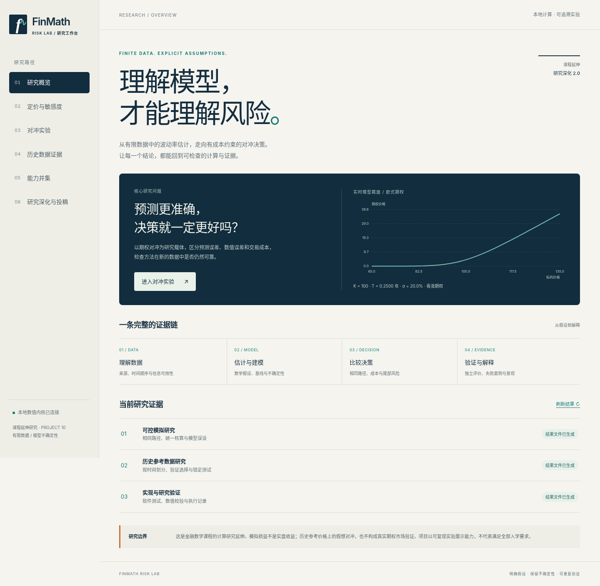
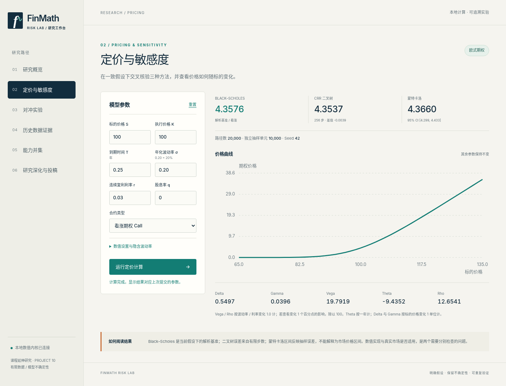
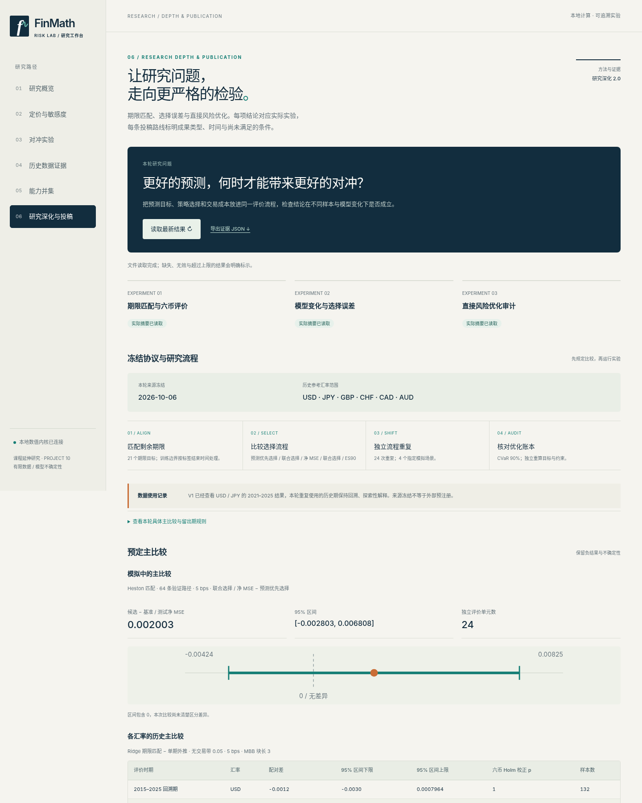

# FinMath Risk Lab V2

> A reproducible local research workbench for finite-data volatility forecasting, cost-aware option hedging, finite-sample strategy selection, and CVaR-based risk learning.

**Version 2.0.0 · 243 Python tests · 55 browser checks · local-only research application**



## English summary

FinMath Risk Lab V2 extends a financial mathematics course into an auditable computational research project. It connects European-option pricing, self-financing hedge ledgers with proportional transaction costs, six-currency walk-forward evaluation, repeated finite-sample procedure selection, and an interpretable CVaR linear program.

The project is designed to preserve null findings and failure cases rather than tune toward favorable test results. Its central question is whether a more accurate forecast actually produces a better downstream hedging decision once selection uncertainty, transaction costs, and distribution shift are included.

This repository is **not** a trading system, a claim of market-optimal performance, or an accepted paper. The web application runs locally and has no account, order, upload, or market-execution functions. Development, experiments, figures, and writing received substantial AI assistance; the contribution boundary is recorded in [`docs/contribution_record.md`](docs/contribution_record.md).

## 中文简介

这是一个金融数学课程延伸研究项目。V2 在原有定价与现金账本核心上加入：

- ECB 六货币的年度滚动与多期限预测；
- Heston 与分布变化下的完整选择流程重复；
- 含交易成本的期权对冲比较；
- 通过线性规划直接学习 CVaR 的可解释策略；
- 冻结协议、结果哈希、独立账本复算、浏览器检查和研究证据导出。

研究重点不是证明复杂模型普遍更优，而是区分预测误差、选择误差、数值误差、交易成本和分布变化，并明确保留无优势结果、预算违反与样本外失效。

## 主要研究结果

| 研究 | 设计与产物 | 实际发现 |
| --- | --- | --- |
| 多期限历史评价 | ECB 六货币，72 个年度折，1–21 步直接 Ridge，54,054 个真实决策预测 | 回顾期六币的 term−flat 主区间均含零，未建立普遍优势 |
| 有限样本策略选择 | 24 次完整重复，4 场景，3 验证规模，2 费用，3 选择器 | Heston 主比较 MSE 差 `+0.002003`，95% CI `[−0.002803,+0.006808]` |
| 凸风险学习 | 24 个 CVaR 线性规划，8 次完整重复，匹配与变化机制 | 匹配 ES90 改善，变化场景恶化；训练仓位约束不保证样本外可行 |

三组研究对应不同问题与模型类，不应解释为同一算法在三套数据上的一致胜利。

## 快速查看

- [V2 论文式报告与发表评估](report/金融数学风险研究_V2_论文式报告与发表评估.docx)
- [冻结研究协议](docs/v2_protocol.json)
- [V2 artifact audit](results/v2_artifact_audit.json)
- [浏览器验证记录](results/browser_validation.json)
- [数据与研究治理](docs/data_governance.md)
- [复现说明](docs/reproducibility.md)

界面另外提供定价、对冲实验、历史证据、能力映射和研究深化页面：

| 定价与敏感度 | 研究深化与投稿路径 |
| --- | --- |
|  |  |

## 本地运行

需要 Python 3.11+。在仓库根目录执行：

```bash
python -m venv .venv
# Windows: .venv\Scripts\python -m pip install -e ".[dev,report]"
# macOS/Linux:
.venv/bin/python -m pip install -e ".[dev,report]"

.venv/bin/python scripts/run_validation.py
.venv/bin/python -m risklab.server --port 8872
```

Windows 启动服务时使用：

```powershell
.venv\Scripts\python -m risklab.server --port 8872
```

浏览器打开 `http://127.0.0.1:8872`。服务只监听本机地址；研究核心和复现脚本无需浏览器。

## 重现 V2

```bash
python scripts/reproduce_v2.py
python scripts/reproduce_v2.py --report
```

也可分别执行：

```bash
python scripts/run_walkforward.py
python scripts/run_selection_study.py
python scripts/run_convex_study.py
python scripts/run_validation.py
python scripts/build_v2_figures.py
python scripts/build_v2_report.py
```

默认使用随仓库归档的数据，无需联网。`requirements-reproduced.txt` 保存产生本次冻结结果时的直接依赖版本。不同平台不保证逐字节数值相同，因此项目同时保存容差、哈希和跨 artifact 一致性检查。

浏览器检查需要 Node、Playwright 和本地服务：

```bash
node tests/browser_qa.cjs
```

`RISKLAB_BROWSER_CHANNEL` 可指定浏览器，`RISKLAB_URL` 可指定服务地址。保存的 55 项浏览器检查不是 WCAG 认证或真实用户研究。

## 文件导航

| 位置 | 内容 |
| --- | --- |
| `risklab/pricing.py` | Black–Scholes、CRR、Monte Carlo、Greeks 与隐含波动率 |
| `risklab/hedging.py` | 自融资对冲账本、比例费用与策略比较 |
| `risklab/term_forecasting.py` | 因果多期限 Ridge、年度切分、选择与推断 |
| `risklab/stochastic_volatility.py` | full-truncation Heston 与诊断 |
| `risklab/advanced_hedging.py` | 带状策略、通用仓位账本与 ES90 |
| `risklab/convex_hedging.py` | 稀疏 CVaR LP、样本约束与数值诊断 |
| `risklab/server.py` | 只读本地工作台与受限数值 API |
| `docs/v2_*method.md` | 三组 V2 研究的完整方法与解释边界 |
| `results/v2_*` | 正式结果、CSV、哈希与核验记录 |
| `MANIFEST.json` | 交付文件的 SHA-256 清单 |

## 验证范围

当前冻结记录包含：

- 243 项 Python 测试；
- 55 项桌面与移动端浏览器检查；
- 6,912 条历史候选指标与 123,552 条历史策略记录核对；
- 11,520 条模拟候选与 1,728 条选择记录核对；
- 24 个凸优化拟合、48 个测试记录与 20,988 个 MSE 分解复算；
- 源数据、协议、结果文件与 SQLite/CSV 等价性检查。

这些检查证明指定版本中的软件行为、账本恒等式与 artifact 一致性，不证明理论新颖性、真实市场可执行性、未来收益或录取/发表结果。

## 解释边界

- ECB 参考汇率不是可执行报价；假设期权不是实际交易。
- 历史二阶矩输入 Black–Scholes delta 是控制启发式，不是隐含风险中性波动率。
- 2015–2025 是回顾性探索；2026 追加期每币只有 9 个 episode，也不是外部预注册确认。
- 模拟选择以 24 个完整流程重复为推断单位；凸优化只有 8 个完整重复。
- LP 数值诊断不等于无限策略空间最优或形式证明；样本外仓位越界已被保留。
- 未训练神经 deep-hedging 强基线，没有真实期权报价，也没有新的一般理论定理。

## 数据、AI 与复用

数据来源、ECB 归属和加工说明见 [`docs/data_governance.md`](docs/data_governance.md) 与 `data/*manifest.json`。本项目不收集个人身份、账户、交易或健康数据。

AI 对架构细化、代码、实验、图表和文稿提供了实质协助。任何学术提交都应根据目标渠道规则披露，并由人类作者承担准确性、原创性与可解释性责任。

本仓库目前未授予开源许可证。公开可见不等于允许复制、再发布或商业使用；ECB 来源材料仍受其原始使用条款约束。
